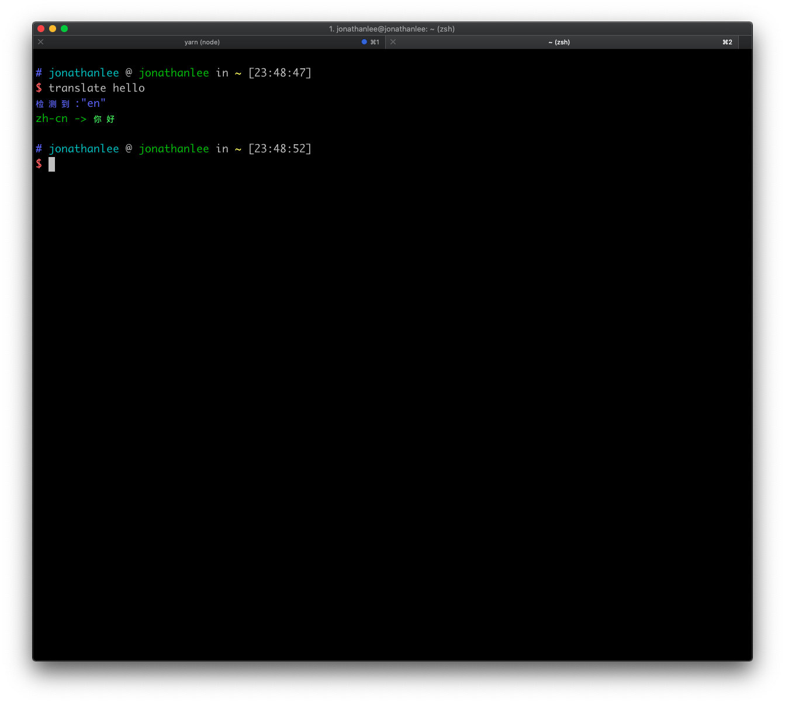
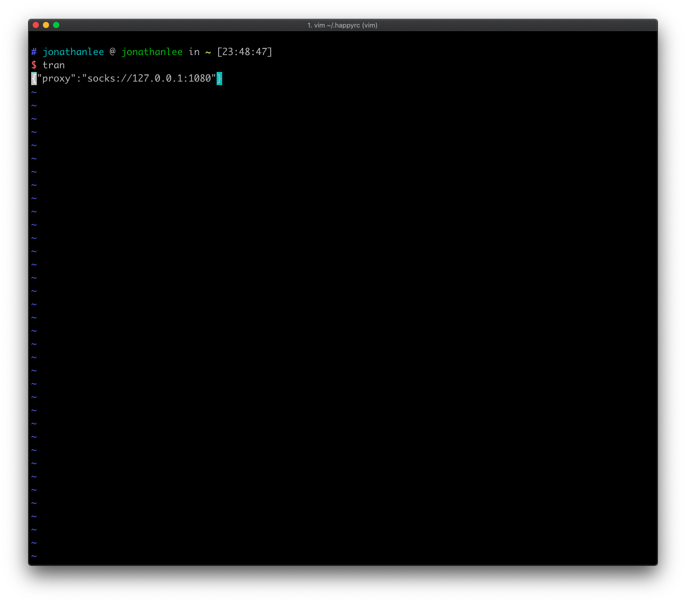

# translate

Translate word in CLI.

## Install

`npm install happy-translate --global`

or

`yarn global add happy-translate`

## Usage

After you installed success, you can use it like below.

## Proxy

Because of this package use *google-translate-api*, so some places like China, you should set a proxy to connect google.

You can set a  environment variable `PROXY` like below.

`PROXY=socks://127.0.0.1:1080 translate hello`

you can also new a file `.happyrc` in you home dir, and set proxy with a key `proxy` like below.

